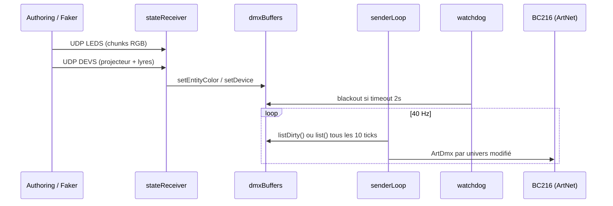

# Documentation générale — LED Routing Hub

Guide pour comprendre l’ensemble du projet. Ce document décrit **ce que fait le logiciel**, **comment les fichiers s’articulent**, et **comment l’utiliser** au quotidien.

---

## 1. À quoi sert ce projet ?

**LED Routing Hub** est le **module de routage** entre :

- **L’authoring** (un autre logiciel qui crée le spectacle) — envoie l’état logique des lumières
- **Le matériel Glassworks** — 4 contrôleurs BC216 qui pilotent le mur LED, un projecteur RGBW et 4 lyres

Le routing **ne connaît pas** les vidéos, la musique ni la timeline artistique. Il reçoit uniquement :

> « L’entité 100 doit être rouge », « la lyre 2 doit pointer là », etc.

…et traduit ça en **paquets ArtNet/DMX** vers les bonnes IP, univers et canaux.

```
┌─────────────────┐     UDP :6455        ┌──────────────────┐     UDP :6454      ┌─────────────┐
│  Authoring      │  LEDS + DEVS         │  LED Routing Hub │  ArtNet ArtDmx     │  4× BC216   │
│  (spectacle)    │ ──────────────────►  │  (ce projet)     │ ─────────────────► │  matériel   │
└─────────────────┘   état logique       └──────────────────┘   512 canaux/univ  └─────────────┘
```

### Principe clé : séparation des responsabilités

| Couche | Sait quoi | Ne sait pas |
|--------|-----------|-------------|
| **Authoring** | Couleurs, animations, lyres, timing | IP des BC216, canaux DMX |
| **Routing (ici)** | Mapping entité → DMX, protocole ArtNet | Contenu créatif du spectacle |
| **Config** (`mur-led.json`) | Installation physique actuelle | Ce qui est affiché à l’écran |

---

## 2. Matériel visé

| Élément | Détail |
|---------|--------|
| WiFi | `GLASS_RESEAUX` / mot de passe `networks` |
| Contrôleurs | 4× BC216 : `192.168.1.45` à `.48` |
| Mur LED | 128×128 pixels = **16 576 entités** (IDs **100** à **19858** environ) |
| Projecteur | Entité logique **1** (RGBW, 4 canaux DMX) |
| Lyres | **4** lyres (deviceId **1–4** dans le protocole DEVS) |
| Fréquence | **40 Hz** (entrée state et sortie ArtNet) |

Chaque BC216 gère plusieurs **univers DMX** (0–31 ou 0–33 selon le contrôleur). Un univers = **512 canaux** DMX.

---

## 3. Structure du dépôt

```
led-routing-hub/
├── config/
│   └── mur-led.json          # Mapping physique (généré depuis Excel)
├── mapping/
│   └── Ecran.xlsx            # Source du mapping (128 bandes + devices)
├── docs/
│   ├── documentation-generale.md   # ← ce document
│   └── protocole-state.md          # Contrat réseau LEDS/DEVS
├── src/
│   ├── core/                 # Cœur du routing (Node.js pur)
│   ├── main/                 # Process Electron (main + moteur)
│   └── renderer/             # Interface graphique (HTML/CSS/JS)
├── tools/                    # Scripts CLI (router, faker, tests matériel…)
└── tests/                    # Tests unitaires Node
```

### Détail `src/core/` — le cœur métier

| Fichier | Rôle en une phrase |
|---------|-------------------|
| `protocol.js` | Encode/décode les paquets UDP `LEDS` et `DEVS` |
| `stateReceiver.js` | Écoute le port 6455, met à jour les buffers DMX |
| `dmxBuffers.js` | Un buffer 512 octets par univers ; applique entités/devices |
| `resolve.js` | Convertit un `entityId` → IP + univers + canal DMX |
| `config.js` | Charge/valide/sauvegarde `mur-led.json` |
| `artnet.js` | Construit et envoie les paquets Art-Net ArtDmx |
| `senderLoop.js` | Boucle 40 Hz : envoie les univers modifiés en ArtNet |
| `senderWorker.js` | Thread worker pour l’envoi UDP (ne bloque pas le main) |
| `watchdog.js` | Blackout automatique si plus de paquets state |
| `blackout.js` | Extinction globale de tous les univers |
| `lyre.js` | Constantes DMX des lyres (14 canaux, presets) |
| `paths.js` | Chemins vers config et mapping |

### Détail `src/main/` — Electron

| Fichier | Rôle |
|---------|------|
| `engine.js` | Classe `RoutingEngine` : assemble receiver + sender + watchdog |
| `main.js` | Fenêtre Electron, cycle de vie de l’app |
| `ipc.js` | Pont IPC entre l’UI et le moteur |
| `preload.js` | Expose `window.routing.*` de façon sécurisée |

### Détail `src/renderer/` — Interface

| Fichier | Rôle |
|---------|------|
| `index.html` | 3 onglets : Dashboard, Moniteur DMX, Configuration |
| `app.js` | Boutons start/stop/blackout, grille DMX 512 canaux |
| `styles.css` | Mise en page |

### Détail `tools/` — Ligne de commande

| Script | Commande npm | Usage |
|--------|----------------|-------|
| `router-cli.js` | `npm run router` | Moteur sans Electron |
| `faker.js` | `npm run faker` | Simule l’authoring (rainbow, lyres…) |
| `test-led.js` | `npm run test-led` | Allume **une** entité LED en direct ArtNet |
| `parse-ecran.js` | `npm run parse` | Génère `mur-led.json` depuis Excel |
| `validate-config.js` | `npm run validate` | Vérifie la cohérence de la config |
| `sniffer.js` | `npm run sniffer` | Écoute le trafic ArtNet entrant |

---

## 4. Flux de données (étape par étape)



### Étape 1 — Réception state (port 6455)

`stateReceiver.js` ouvre un socket UDP et distingue deux types de messages via le **magic** ASCII :

- `LEDS` → couleurs du mur (entités 100+)
- `DEVS` → projecteur (deviceId 0) + lyres (deviceId 1–4)

Détails binaires : [protocole-state.md](./protocole-state.md).

Points importants :

- **Full state** : chaque frame contient toutes les entités (pas de delta partiel)
- **Chunking** : max 400 entités par paquet LEDS (~50 paquets pour tout le mur)
- **frameId** : numéro de frame ; les paquets obsolètes sont ignorés

### Étape 2 — Résolution entité → DMX

Quand une couleur arrive pour l’entité `100`, `dmxBuffers.js` appelle `resolveEntity(100, segments)` :

```javascript
// Résultat typique pour entité 100
{
  entityId: 100,
  type: "rgb",
  controllerIp: "192.168.1.45",  // BC216-1 = quart gauche
  universe: 0,
  dmxChannel: 1,                  // canal DMX de départ (R)
  channels: ["r", "g", "b"]
}
```

La formule pour une entité LED dans un segment :

```
pixelIndex = entityId - segment.entityStart
canal DMX = segment.dmxChannelStart + pixelIndex × 3
```

### Étape 3 — Buffers DMX

Pour **chaque couple** `(IP contrôleur, univers)`, le système maintient un `Buffer(512)` initialisé à 0.

- `setEntityColor` écrit R, G, B (ou R,G,B,W pour le projecteur)
- `setDevice` écrit les 14 canaux d’une lyre ou le RGBW du projecteur
- Les univers **modifiés** sont marqués « dirty »

Au total : ~130 buffers (4 contrôleurs × ~32 univers chacun).

### Étape 4 — Envoi ArtNet (port 6454)

`senderLoop.js` tick toutes les **25 ms** (40 Hz) :

1. Récupère les univers **dirty** (modifiés depuis le dernier envoi)
2. Tous les **10 ticks**, force l’envoi de **tous** les univers (filet de sécurité)
3. Délègue l’envoi UDP au **worker thread** (`senderWorker.js`)

Chaque paquet = en-tête Art-Net + jusqu’à 512 valeurs DMX.

### Étape 5 — Watchdog (sécurité)

Si **aucun paquet state** n’arrive pendant **2 secondes** (après 5 s de grâce au démarrage), `watchdog.js` :

1. Met tous les buffers à 0 (blackout)
2. Log un avertissement
3. Reprend normalement dès que les paquets reviennent

À l’arrêt du moteur (`Ctrl+C` ou bouton Stop), un **blackout ArtNet** est aussi envoyé (8 répétitions).

---

## 5. La configuration `mur-led.json`

Fichier central : **`config/mur-led.json`** (~1750 lignes). Généré par `npm run parse` depuis `mapping/Ecran.xlsx`.

### Structure

```json
{
  "version": 1,
  "generatedFrom": "mapping/Ecran.xlsx",
  "controllers": [ /* 4 BC216 */ ],
  "segments": [ /* 128 bandes LED + 4 lyres + 1 projecteur */ ],
  "stats": {
    "ledEntityCount": 16576,
    "segmentCount": 133
  }
}
```

### `controllers` — les BC216

```json
{
  "ip": "192.168.1.45",
  "label": "BC216-1",
  "universeMin": 0,
  "universeMax": 31
}
```

Définit quels univers existent physiquement sur chaque boîtier.

### `segments` — le mapping

Trois types :

#### Type `rgb` — bande du mur LED

```json
{
  "name": "1",
  "type": "rgb",
  "entityStart": 100,
  "entityEnd": 269,
  "entityCount": 170,
  "controllerIp": "192.168.1.45",
  "universe": 0,
  "dmxChannelStart": 1,
  "channelsPerEntity": 3
}
```

- **128 segments** (lignes 2–129 du Excel)
- Entités **100 → ~19858**
- Chaque pixel = 3 canaux DMX (R, G, B)

#### Type `rgbw` — projecteur

```json
{
  "name": "Projector",
  "type": "rgbw",
  "entityStart": 1,
  "entityEnd": 1,
  "controllerIp": "192.168.1.48",
  "universe": 33,
  "dmxChannelStart": 1,
  "dmxChannelEnd": 4
}
```

- Entité logique **1** dans le protocole
- deviceId **0** dans DEVS

#### Type `moving_head` — lyre

```json
{
  "name": "Lyre 1",
  "type": "moving_head",
  "controllerIp": "192.168.1.48",
  "universe": 33,
  "dmxChannelStart": 10,
  "dmxChannelEnd": 23,
  "channelsPerEntity": 14
}
```

- deviceId **1–4** dans DEVS (index lyre + 1)
- 14 canaux : pan, tilt, dimmer, shutter, roue couleur, etc.

### Validation (`validate-config.js`)

Vérifie :

- IPs uniques
- Pas de chevauchement de canaux sur un même `(IP, univers)`
- Aucun segment ne dépasse le canal 512

---

## 6. Protocole state (résumé)

Transport : **UDP port 6455**, **40 Hz**, little-endian.

| Message | Contenu | Magic |
|---------|---------|-------|
| `LEDS` | Couleurs RGB du mur (chunked) | `4C 45 44 53` |
| `DEVS` | Projecteur + 4 lyres (16 octets/device) | `44 45 56 53` |

Ordre d’envoi recommandé par frame :

1. Tous les chunks `LEDS` (chunkIndex 0 … N-1)
2. Un paquet `DEVS`

**Spec complète** : [protocole-state.md](./protocole-state.md)

### IDs logiques

| Élément | ID dans le protocole |
|---------|---------------------|
| Projecteur RGBW | `deviceId: 0` dans DEVS, ou entité `1` |
| Lyre 1–4 | `deviceId: 1` à `4` dans DEVS |
| Pixel mur LED | `entityId: 100` à `~19858` dans LEDS |

L’authoring **n’a jamais besoin** de connaître les IP ou canaux DMX — seulement ces IDs logiques.

---

## 7. Profil DMX des lyres

Défini dans `src/core/lyre.js` — offsets relatifs au `dmxChannelStart` :

| Offset | Canal | Description |
|--------|-------|-------------|
| 0 | pan | Pan coarse |
| 1 | panFine | Pan fine |
| 2 | tilt | Tilt coarse |
| 3 | tiltFine | Tilt fine |
| 4 | dimmer | Intensité (255 = full) |
| 5 | shutter | 40 = ouvert |
| 6 | colorWheel | Roue couleur |
| 7 | r | Rouge |
| 8–13 | g, b, aux… | Certains marqués « dangereux » (forcés à 0 à l’écriture) |

Constantes utiles :

- `DIMMER_FULL = 255`
- `SHUTTER_OPEN = 40`
- `CENTER = 128` (position neutre pan/tilt)

---

## 8. L’application Electron

### Démarrage

```bash
npm install
npm start
```

### Onglets

1. **Dashboard** — Démarrer/arrêter le moteur, dry-run ArtNet, blackout manuel, stats JSON
2. **Moniteur DMX** — Grille 512 canaux pour un univers choisi (debug)
3. **Configuration** — Éditeur JSON de `mur-led.json` avec validation

### Pont UI ↔ moteur

```
renderer/app.js  →  window.routing.*  →  preload.js  →  ipc.js  →  RoutingEngine
```

API exposée (`preload.js`) :

- `start({ dryRun })`, `stop()`, `status()`, `blackout()`
- `getConfig()`, `saveConfig()`, `validateConfig()`, `reloadConfig()`
- `listUniverses()`, `dmxSnapshot(ip, universe)`

---

## 9. Workflows courants

### A. Développement local (sans matériel)

Terminal 1 — moteur en dry-run :

```bash
npm run router -- --dry-run
```

Terminal 2 — faker (simule l’authoring) :

```bash
npm run faker -- --duration 30 --pattern rainbow
```

Le moteur logue les paquets sans envoyer d’ArtNet réel.

### B. Test d’une LED sur le mur

Connecté au WiFi `GLASS_RESEAUX` :

```bash
npm run test-led -- --entity 100 --color 255,0,0
```

Résout l’entité 100 → BC216 `.45` univers 0 canal 1, envoie du rouge.

### C. Régénérer la config après modification Excel

```bash
npm run parse
npm run validate
```

### D. Production (spectacle réel)

1. Lancer le routing : `npm run router` ou `npm start`
2. L’authoring envoie LEDS+DEVS vers `IP_du_routing:6455`
3. Le watchdog garantit l’extinction si l’authoring plante

### E. Debug réseau ArtNet

```bash
npm run sniffer
```

Affiche les paquets ArtNet reçus par source/univers.

---

## 10. Tests unitaires

```bash
npm test
```

| Fichier | Ce qui est testé |
|---------|-----------------|
| `protocol.test.js` | Encode/decode LEDS et DEVS, frameId |
| `resolve.test.js` | Entité 100 → .45, entité 15100 → .48, lyres, projecteur |
| `dmxBuffers.test.js` | Écriture couleurs dans les buffers |
| `artnet.test.js` | Construction paquets ArtDmx |

Les tests chargent la vraie config `mur-led.json` — il faut avoir lancé `npm run parse` au préalable.

---

## 11. Choix techniques (pourquoi c’est fait ainsi)

1. **Full state, pas de delta** — simplicité ; un paquet perdu se corrige à la frame suivante (~25 ms)
2. **Chunking LEDS (400 entités max)** — respecte la MTU UDP (~1213 octets/paquet)
3. **Worker thread pour ArtNet** — l’envoi UDP ne bloque pas le receiver ni l’UI Electron
4. **Envoi dirty + refresh complet /10 ticks** — optimise le trafic tout en garantissant la cohérence
5. **Zéro dépendance npm runtime** — seul Electron en devDependency ; le cœur tourne avec Node 18+ pur
6. **Config JSON externalisée** — changer une IP = éditer JSON, pas recompiler

---

## 12. Glossaire

| Terme | Signification |
|-------|---------------|
| **Entité** | Identifiant logique d’un pixel LED (100+) ou du projecteur (1) |
| **Segment** | Plage d’entités mappée sur un univers/canaux DMX |
| **Univers DMX** | Ensemble de 512 canaux ; adressé par `(IP BC216, numéro univers)` |
| **ArtNet** | Protocole UDP standard pour transporter du DMX sur Ethernet |
| **State** | Snapshot complet de l’état lumière à un instant T |
| **Authoring** | Logiciel créatif qui produit le spectacle (repo séparé) |
| **BC216** | Contrôleur Glassworks qui convertit ArtNet → DMX physique |
| **Blackout** | Mise à zéro de tous les canaux (extinction) |
| **Dry-run** | Mode simulation sans envoi réseau ArtNet |

---

## 13. Repères de mapping (mémo)

| Entité | Contrôleur | Zone mur |
|--------|------------|----------|
| 100 | 192.168.1.45 | Quart **gauche**, haut |
| ~5100 | 192.168.1.46 | Centre-gauche |
| ~10100 | 192.168.1.47 | Centre-droit |
| ~15100 | 192.168.1.48 | Quart **droit** |

Projecteur + lyres : tous sur **192.168.1.48 univers 33**.

---

## 14. Dépannage

| Symptôme | Cause probable | Action |
|----------|---------------|--------|
| `Config introuvable` | Pas de `mur-led.json` | `npm run parse` |
| Mur reste noir | Authoring non lancé ou mauvaise IP/port | Vérifier faker ou authoring sur `:6455` |
| Mur figé coloré | Authoring a planté, watchdog pas actif | Normal après 2s → blackout ; vérifier logs |
| Une LED ne s’allume pas | Mauvaise entité ou pas sur le bon WiFi | `npm run test-led -- --entity N --dry-run` puis sans dry-run |
| Config invalide | Chevauchement canaux | `npm run validate`, corriger segments |
| Pas d’ArtNet vu | Dry-run activé ou mauvais réseau | Désactiver dry-run, `npm run sniffer` |

---

## 15. Fichiers à lire en priorité

Pour comprendre le code dans l’ordre :

1. `docs/protocole-state.md` — le contrat réseau
2. `src/main/engine.js` — orchestration
3. `src/core/stateReceiver.js` — entrée UDP
4. `src/core/dmxBuffers.js` + `resolve.js` — cœur du mapping
5. `src/core/senderLoop.js` — sortie ArtNet
6. `tools/faker.js` — exemple complet d’émetteur state
7. `config/mur-led.json` — vérité terrain du mapping

---

## 16. Relation avec l’authoring

Ce repo est **uniquement le routing (P4)**. L’authoring (timeline, effets, vidéos) vit dans un **autre dépôt** et communique via le protocole UDP décrit ci-dessus.

Le `tools/faker.js` joue le rôle de l’authoring minimal pour les tests : arc-en-ciel sur tout le mur + mouvement des lyres.

Pour brancher un vrai authoring :

1. Implémenter l’envoi `LEDS` (tous chunks) + `DEVS` à 40 Hz
2. Cibler l’IP de la machine qui tourne `npm run router`
3. Port **6455**
4. Utiliser les entityId/deviceId de la config

---

*Dernière mise à jour : générée pour le dépôt `led-routing-hub` tel qu’il existe dans le workspace.*
